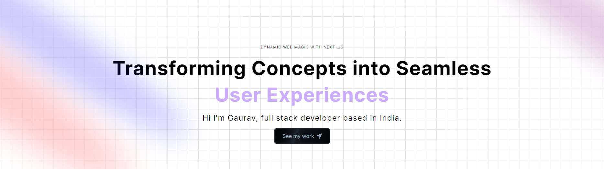

# Welcome! To Modern Portfolio 💜

  
  

 

  

    
    
    
    
  

 

# My Learning

### Further development

### My Progress

### TODO's
 - Utilities for tailwindcss [open](./src/app/globals.css) 77

# Acknowledgments

<a href="https://www.youtube.com/watch?v=FTH6Dn3AyIQ" target="_blank" rel="noreferrer"> 
JavaScript Mastery
</a>

# Feedback for me

# Useful Resources

# Course

## For Developers

    ## The challenge
    ## Clone Repo
    ## Assets
    ## Figma file
    ## Share your project with me
    ## Need Help from me

**Have fun Coding 🚀**
